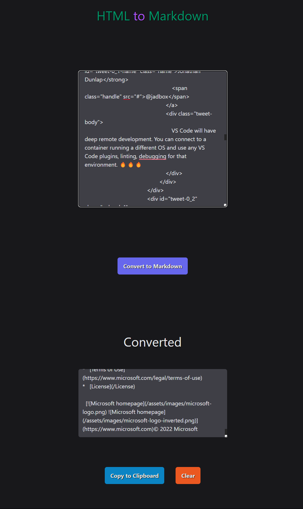

# HTML to MARKDOWN Converter


[Image Provided By Free Icons Library](https://icon-library.com/icon/markdown-icon-8.html.html)  


 

## Description

Turn HTML into GitHub Flavored Markdown.

## Features

HTML to Markdown is a Single Page Application (SPA) built using the following technologies:

### Tech-Stack

| Description                          | Links                                                            |
| ------------------------------------ | ---------------------------------------------------------------- |
| HTML                                 | [HTML5](https://developer.mozilla.org/en-US/docs/Glossary/HTML5) |
| Cascading Style Sheets / TailwindCSS | [TailwindCSS](https://tailwindcss.com/)                          |
| Turndown, convert HTML to Markdown   | [Turndown](https://www.npmjs.com/package/turndown)               |
| TypeScript => JavaScript             | [TypeScript](https://www.typescriptlang.org/)                    |
| VS Code                              | [VS Code](https://code.visualstudio.com/)                        |
| GitHub Pages                         | [GitHub Pages](https://pages.github.com/)                        |

## Usage

### Live Deployment

You can access the application at [https://iitoneloc.github.io/html-to-markdown/](https://iitoneloc.github.io/html-to-markdown/).

### Local Usage

1. Clone the repo [https://github.com/iiTONELOC/html-to-markdown.git](https://github.com/iiTONELOC/html-to-markdown.git)
   ```bash
   git clone https://github.com/iiTONELOC/html-to-markdown.git
   ```
2. Install the dependencies
   ```bash
   npm i
   # or
   npm install
   ```
3. Run the project locally
   There are two options for running locally, if you wish to make changes you can run the project in dev mode which will compile the project and listen for file changes. Or you can simply compile the project to access the app locally.
   1. Build and run dev server:
   ```bash
       npm run dev
       # windows
       start dist/index.html
       # mac/linux
       open dist/index.html
   ```
   2. Compile and access locally:
   ```bash
       # windows
       npm run build | start dist/index.html
       # mac/linux
       npm run build && open dist/index.html
   ```

## Screenshot



## How to Contribute

Not accepting contributions for this particular project, but if you wish to collaborate feel free to reach out!

## Contact

If you have any questions please feel free to email me @ [anthonytropeano@protonmail.com](mailto:anthonytropeano@protonmail.com)

## LICENSE

This project is licensed under the [MIT LICENSE](./LICENSE)
